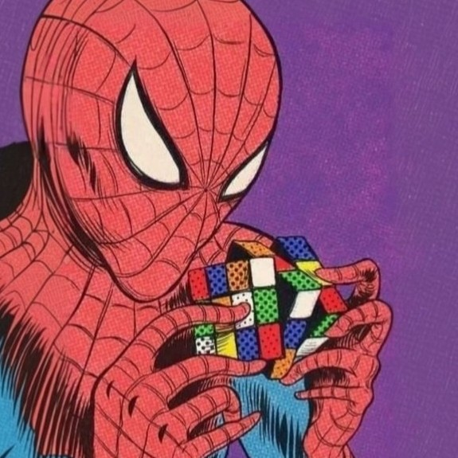
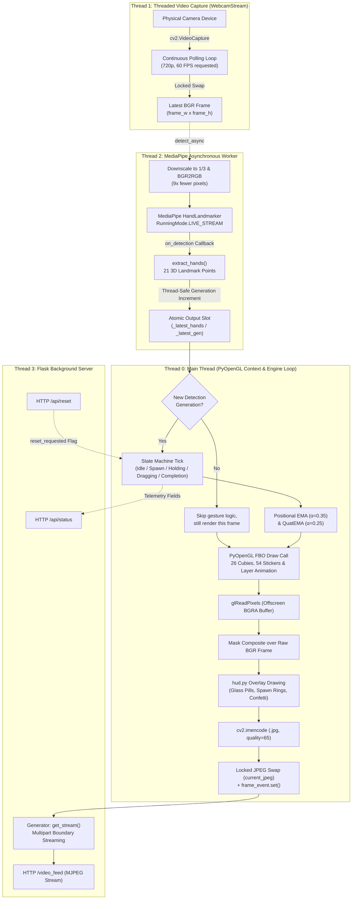
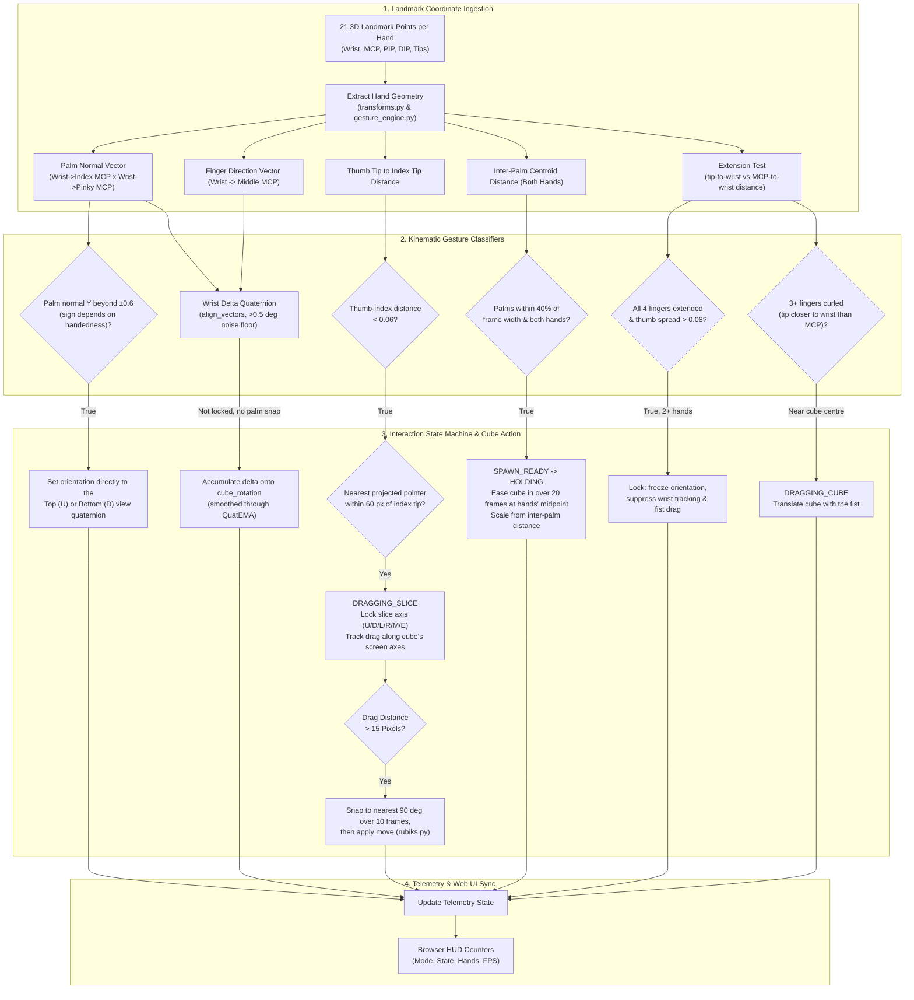

<div align="center">

# T-PERM
### [ Touchless Permutation & Execution for Rubik’s Manipulation ]

<br/>



<br/><br/>

```yaml
System Specification:
  Vision Core       : MediaPipe Tasks Vision (21 3D Landmarks / Non-Blocking LIVE_STREAM Mode)
  Frame Ingestion   : Threaded OpenCV WebcamStream (720p, 60 FPS requested from the driver)
  3D Graphics       : PyOpenGL Offscreen Framebuffer (FBO), fixed-function per-vertex lighting
  Kinematics Filter : Positional EMA (α=0.35) & Normalised Quaternion LERP (QuatEMA α=0.25)
  State Permutation : 18 standard 3x3 turns + M/E slice moves, with solved-state checking
  Network Gateway   : Flask Multi-Part MJPEG Video Streaming (/video_feed) & JSON Telemetry Sync
```


<table>
  <tr>
    <td width="33%" valign="top">
      <h4>Vision & Kinematics</h4>
      <p>21 3D landmarks per hand via non-blocking <code>LIVE_STREAM</code> callbacks, EMA positional smoothing, and <code>QuatEMA</code> orientation tracking.</p>
    </td>
    <td width="33%" valign="top">
      <h4>Threaded Concurrency</h4>
      <p>Webcam I/O, MediaPipe inference, main-thread PyOpenGL FBO rendering, and Flask streaming all run without blocking one another.</p>
    </td>
    <td width="33%" valign="top">
      <h4>3×3 Permutation Engine</h4>
      <p>All 18 standard face moves plus M/E slices, pointer-projected layer selection via pinch-and-drag, and automatic solve verification.</p>
    </td>
  </tr>
</table>

</div>

---

## Overview

T-PERM bridges physical hand kinematics and virtual 3D cube manipulation without physical controllers or wearables. By capturing a camera feed, tracking 21 3D landmarks per hand asynchronously, and computing spatial transformations in real-time, the system maps hand movements directly into Rubik's Cube actions: spawning, 3D orientation tracking, layer turning via pinch-and-drag, cube repositioning, and solve-state evaluation.

Everything — tracking, 3D rendering, and compositing — happens in the Python backend. The browser is a thin client that displays the resulting MJPEG stream and polls telemetry.

---

## Backend System & Concurrency Pipeline

The backend runs across four threads so that inference never stalls the render loop.



### Architectural Highlights
- **Threaded I/O Isolation**: The webcam capture loop runs continuously on `WebcamStream`, so the engine always reads the newest frame instead of blocking inside `cap.read()`.
- **Asynchronous Inference**: MediaPipe runs in `RunningMode.LIVE_STREAM`. Every frame is submitted without blocking; results arrive later via a thread-safe callback, and the mode drops submissions on its own while busy. The engine tracks a generation counter so gesture logic only runs on genuinely new detections.
- **Main-Thread OpenGL**: On Windows, PyOpenGL contexts bound via WGL must stay on the process's main thread, so the engine loop owns the main thread and Flask is relegated to a daemon thread.
- **Frame pacing**: The loop targets ~45 FPS rather than running flat out, deliberately leaving CPU headroom for MediaPipe inference.

---

## Gesture Kinematics & Interaction Flow



---

## Technical Deep Dive

### Landmark Smoothing
Raw computer-vision landmarks jitter with lighting and auto-exposure changes. Two filters absorb that:

1. **Positional EMA** — the 2D spawn midpoint is filtered with a single-pole exponential moving average:
   $$P_t = \alpha \cdot X_t + (1 - \alpha) \cdot P_{t-1}, \quad \alpha = 0.35$$

2. **Orientation QuatEMA** — hand rotation is derived as a quaternion from the palm normal and finger-direction vectors (`Rotation.align_vectors`, weighted 1.0 / 0.7), then smoothed by **normalised linear interpolation**: component-wise lerp followed by renormalisation, with a hemisphere check first so the quaternion double-cover never causes a flip.
   $$Q_t = \frac{\alpha \cdot Q_{\text{target}} + (1 - \alpha) \cdot Q_{t-1}}{\lVert \alpha \cdot Q_{\text{target}} + (1 - \alpha) \cdot Q_{t-1} \rVert}, \quad \alpha = 0.25$$

   Nlerp rather than true slerp: at these per-frame angles the two are visually indistinguishable, and nlerp costs a few multiplies instead of trigonometry.

### Cube State & Permutation Engine
The cube state is a dict of 6 faces × 9 stickers, indexed row-major from the outside view (index 4 is the fixed centre). Every move is a pure function — deep-copy in, permuted state out, input untouched. Implemented: `U D L R F B` clockwise, counter-clockwise (`'`) and double (`2`), plus the `M` and `E` slice moves used when a drag starts on the cube's middle layer.

`test_rubiks.py` pins the engine down with the invariants that catch index bugs: the sticker census is preserved across a 50-move scramble, every quarter turn has order 4, each move cancels its inverse, doubles equal two quarters, and the sexy move `(R U R' U')` returns to solved after 6 repetitions.

### Layer Selection
There is no ray cast. The renderer places 26 pointer nodes on a 3×3×3 lattice around the cube, projects each to screen space with `gluProject`, and returns the visible ones. On pinch, the engine picks the pointer nearest the index fingertip within 60 px and locks that layer.

The hit-test uses the *previous* frame's projected pointers rather than re-rendering. Rendering mid-tick would cost a second full FBO draw plus `glReadPixels` on every pinch frame and would advance the orientation filter twice in one tick; one frame of staleness at ~45 FPS is ~22 ms.

Drag direction then resolves the move: the swipe vector is projected onto the cube's own X and Y axes as they currently appear on screen, and whichever dominates picks a row (`U`/`E`/`D`) or column (`R`/`M`/`L`) turn. The angle eases to the nearest 90° over 10 frames before the permutation is committed.

---

## Gesture Control Reference

| Gesture | Kinematic Threshold | Functional Action |
|:---|:---|:---|
| **Both hands close together** | Palm centres within 40% of frame width | Spawns the cube between your hands; inter-palm distance sets its scale. |
| **Wrist rotation & tilt** | Palm normal + finger direction, >0.5° noise floor | Rotates the cube in 3D to inspect any face. |
| **Palm facing downward** | Palm normal Y beyond ±0.6 (sign by handedness) | Snaps the view to the Top (U) face. |
| **Palm facing upward** | Palm normal Y beyond ±0.6, opposite sign | Snaps the view to the Bottom (D) face. |
| **Pinch + drag** | Thumb-to-index distance < 0.06, within 60 px of a pointer | Selects that layer and turns it; commits past a 15 px drag. |
| **Fist near the cube** | 3+ fingers curled, fist within the cube's radius | Grabs and repositions the whole cube on screen. |
| **Open palm (show 5)** | All 4 fingers extended, thumb spread > 0.08, **two hands visible** | Locks orientation — pauses rotation and fist-drag. |
| **Hands removed from frame** | 48 consecutive empty detections (~1s) | Checks the cube and shows the solved banner + confetti, or a red flash. |

> The lock gesture is only evaluated when at least two hands are in frame — one open palm alone will not lock the cube.

---

## Project Structure

```
ar-rubiks/
├── backend/
│   ├── cube/
│   │   ├── renderer.py        # PyOpenGL FBO pipeline, cubie & sticker geometry
│   │   └── rubiks.py          # 3x3 permutation engine, move sets, solve check
│   ├── utils/
│   │   ├── smoothing.py       # EMA and quaternion smoothing utilities
│   │   └── transforms.py      # Vector geometry, screen axes, 90-degree snapping
│   ├── gesture_engine.py      # Stateless gesture classifiers + absence detector
│   ├── hand_landmarker.task   # MediaPipe Hand Landmarker pre-trained model
│   ├── hand_tracker.py        # Threaded webcam capture and MediaPipe wrapper
│   ├── hud.py                 # HUD overlays, banners, and confetti particles
│   ├── requirements.txt       # Python package dependencies
│   ├── server.py              # Main OpenGL execution loop and Flask MJPEG server
│   └── test_rubiks.py         # Self-check for the permutation engine
├── bin/
│   └── ar-rubiks.js           # CLI runner: dependency check and launch
├── frontend/
│   ├── css/
│   │   └── style.css          # Dark console user interface styling
│   ├── js/
│   │   └── app.js             # Stream mounting, telemetry polling, user actions
│   └── index.html             # Main browser console interface
├── assets/
│   └── poster.jpeg            # Project graphic asset
├── package.json               # Node.js project manifest
└── README.md                  # System documentation
```

---

## Getting Started

### Prerequisites

- Python 3.9 or higher
- A working webcam
- Node.js (optional, for the CLI runner)
- Graphics driver with OpenGL 2.1+ support

---

### Method 1: Quick Launch via Node CLI

```bash
node bin/ar-rubiks.js
```

The runner locates Python, verifies `hand_landmarker.task` is present, installs the Python dependencies **only if they are not already importable**, starts `server.py`, and opens the console at `http://localhost:5000`. Pass `--deps` to force a dependency reinstall.

---

### Method 2: Manual Setup & Execution

#### 1. Set up the backend environment

```bash
cd backend

# Windows:
python -m venv venv
venv\Scripts\activate

# Linux / macOS:
python3 -m venv venv
source venv/bin/activate

pip install -r requirements.txt
```

#### 2. Start the server

```bash
python server.py
```

#### 3. Open the interface

`server.py` serves the frontend itself — just open:

```
http://localhost:5000
```

Then click **Engage camera**. No separate static file server is needed.

---

### Running the tests

```bash
cd backend
python test_rubiks.py
```

No test framework required — it is a plain script of assertions.

---

## API Endpoints & Telemetry Contract

| Endpoint | Method | Response Type | Description |
|:---|:---|:---|:---|
| `/` | `GET` | `text/html` | The web console (`frontend/index.html`). |
| `/video_feed` | `GET` | `multipart/x-mixed-replace` | MJPEG stream of composited camera + 3D frames. |
| `/health` | `GET` | `application/json` | Heartbeat: `{"status": "ok", "name": ..., "running": bool}`. |
| `/api/status` | `GET` | `application/json` | Telemetry: `{"running": bool, "state": "HOLDING", "hands": 2, "fps": 44}`. |
| `/api/reset` | `POST` / `GET` | `application/json` | Re-solves the cube and applies a new random 20-move scramble. |

---

## Known Limitations

- Slice selection uses the previous frame's projected pointers, so a very fast pinch onto a moving cube can miss by roughly one frame.
- The lock gesture requires two hands in frame (see the note above).
- Palm-up / palm-down snapping sets the orientation instantly rather than animating to it.
- Tuned against a 720p webcam at roughly arm's length; the pinch and spawn thresholds in `gesture_engine.py` are normalised but may still want adjusting for unusual camera placement or field of view.
